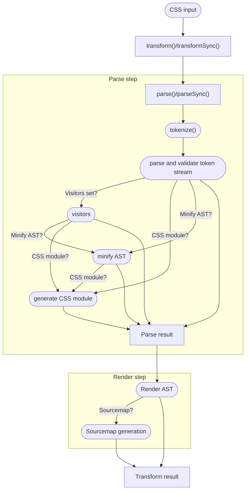

# CSS parser architecture

```mermaid
flowchart TD
    %% --- Transform ---
    Input(["CSS input"])
    transform["transform()/transformSync()"]


    %% The Grouped Container
    subgraph Group1 ["Parse step"]

        %% --- Parse step ---
        parse["parse()/parseSync()"]
        tokenize(["tokenize()"])
        parseNode(["parse and validate token stream"])
        visitors(["visitors"])
        minify(["minify AST"])
        cssModules(["generate CSS module"])
        parseResult["Parse result"]
    end

    %% The Grouped Container
    subgraph Group2 ["Render step"]

        %% --- Render step ---
        renderAst(["Render AST"])
        sourcemap([Sourcemap generation])

    end


    %% --- Result step ---
    transformResult["Transform result"]

    %% --- Routing step ---
    Input --> transform
    transform --> parse
    parse --> tokenize
    tokenize --> parseNode
    parseNode -- "Visitors set?"  --> visitors
    visitors -- "Minify AST?"  --> minify
    minify -- "CSS module?"  --> cssModules
    visitors -- "CSS module?"  --> cssModules
    cssModules --> parseResult
    parseNode -- "CSS module?" --> cssModules
    parseNode -- "Minify AST?"  --> minify
    parseNode --> parseResult
    visitors --> parseResult
    minify --> parseResult
    parseResult --> renderAst
    renderAst -- "Sourcemap?" --> sourcemap
    renderAst --> transformResult
    sourcemap --> transformResult

```
------
[← Usage](./usage.md) | [Validation →](./Guide.Validation.html) 

